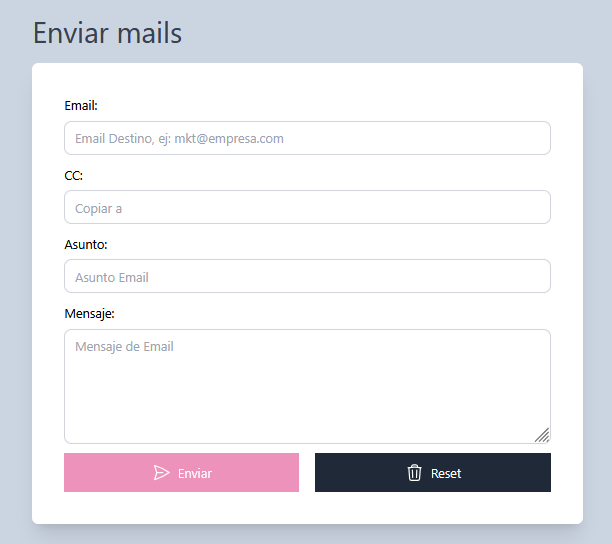

# Simulador de envio de emails

Este es un proyecto creado con la finalidad de poder validar campos, mostrar alertas y hacer obligatorios algunos y otros no. De este modo simulando el envio de correos. Fue desarrollador con JavaScript, HTML y Tailwind CSS. 

## Screenshots

## Tech Stack

**Frontend:** HTML, JS y Tailwind CSS

